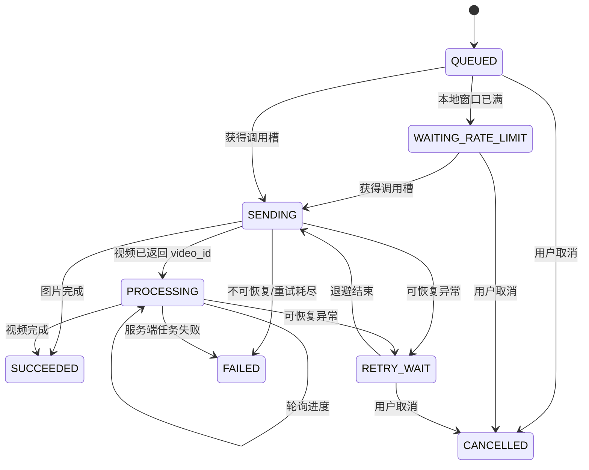

# 架构与状态设计

## 组件

| 层 | 职责 |
|---|---|
| Compose UI | 对话、图片、视频、队列、设置；参数校验提示与结果预览 |
| `AppViewModel` | UI 状态、多轮对话、SSE 增量合并、Tool Call 回填 |
| `PayloadBuilder` | 三种模态的请求映射、核心字段覆盖、同步参数校验 |
| `AgnesApiClient` | HTTPS、SSE、图片请求、视频创建与轮询、取消传播 |
| `ErrorMapper` | HTTP/网络/参数异常归类为可见且可操作的错误 |
| `AppDatabase` | 对话及独立参数快照、消息、任务及生成设置、逐任务调用日志、限流时间戳；SQLite WAL |
| `GenerationQueue` | WorkManager 唤醒与后台恢复 |
| `QueueProcessor` | 任务状态机、限流、远端轮询、重试和结果落盘 |
| `SecureKeyStore` | Android Keystore + AES-GCM 凭据保护 |
| `MediaFileStore` | SAF 导入、Data URI、结果下载与本地文件 |
| `TemporaryMediaUploader` | 临时公开托管、逐服务故障切换与换源日志 |

## 生成任务状态

`SENDING` 与 `PROCESSING` 都是可恢复状态。进程中断后，Worker 会优先拾取它们；已有 `video_id` 的视频只恢复轮询，不重复创建。常规轮询固定间隔 30 秒，轮询异常进入重试时也应用 30 秒最小间隔。

## 异常决策

| 场景 | 用户反馈 | 自动重试 |
|---|---|---|
| 本地队列达到容量 | 显示容量，拒绝新任务 | 否 |
| 本地 RPM 窗口已满 | 倒计时与“限流等待” | 窗口到期继续 |
| HTTP 429 | “服务端限流”，尊重 Retry-After | 是 |
| 5xx 且正文含队列满/繁忙语义 | “远端队列已满” | 是，至少等待 60 秒 |
| 408、网络 I/O、DNS、超时 | 明确网络/超时状态 | 是 |
| 普通 5xx/503 | “服务暂时异常” | 是 |
| 400/422 | 显示具体参数修正建议 | 否 |
| 401/403 | 引导检查 Key/权限 | 否 |
| 429 且明确 quota/credit/balance | 引导检查额度 | 否 |
| 内容安全拒绝 | 引导修改提示词/素材 | 否 |
| 本地素材不可读取或 URL 不合规 | 指明素材与 URL 要求 | 否 |

退避时间采用指数增长并加入随机抖动，上限 5 分钟；次数可在设置中配置。

## 流式对话

SSE 按空行组成事件，合并多行 `data:`。每个事件可同时增量更新：

- 正文 `delta.content`
- reasoning 字段
- `tool_calls[index]` 的 id、函数名和 arguments 分片
- usage
- finish_reason

用户停止或网络在收到首个 token 后中断时，已生成内容会以“已中断”状态保留，避免视觉上突然消失。工具调用只显示和等待回填，不自动执行未知函数。

流式更新不会锁定列表：用户一旦向上浏览便暂停自动跟随，回到列表末尾或点击“回到底部”后才恢复。每条消息由正文组件直接持有并保存展开状态，避免外层列表状态在流式重组时覆盖按钮操作；全文与 6 行/260 字短预览使用两个独立组件分支。执行收起时等待新高度完成测量，再让 LazyColumn 定位该消息，避免长 item 缩短后被旧滚动锚点抵消。

调用日志对消息与详情分别使用同一套“真实截断字符串 + 最大行数”策略。界面折叠不改变数据库原文，“复制全部”始终导出未截断日志。

视频本地素材中转采用顺序故障切换：优先 Uguu，失败后尝试 Litterbox；每次尝试、失败原因、换源与最终直链都写入脱敏任务日志。单个素材上传成功后，在 HTTP 响应回调返回前将直链和过期时间更新进持久化 `spec_json`，避免父协程取消时丢失返回值。创建失败后的自动/手动重试及进程恢复都会复用该直链；只有进入到期前 60 秒安全窗口才重新上传。全部服务失败后统一交回持久队列退避重试。关闭中转开关时不会调用任何第三方托管服务。

1.0.8 的取消恢复改动（待运行验证）：

- HTTP 使用异步回调桥接。取消立即调用 `Call.cancel()`；队列等待响应回调和本地检查点完成清理后才释放执行权。
- `QueueProcessor` 在 AppGraph 中保持单实例，互斥整个 drain；同进程内重叠 Worker 不会同时领取 `SENDING` 任务。
- 后台取消保留活动任务、已缓存 URL 和已知 `video_id`，不转为用户取消或终态失败；日志记录 Worker ID 与停止原因。
- 视频创建的成功响应先保存 `video_id` 再恢复调用协程，已知远端任务继续按 30 秒间隔轮询。
- 用户取消会停止当前请求；手动重新排队等待旧执行清理完毕，迟到响应不会覆盖用户取消状态。
- 未收到服务器返回的 `video_id` 时，客户端无法证明服务器是否接受过请求；当前仍没有服务端幂等契约，因此网络中断后的再次提交不能保证远端绝不重复。

每个 conversation 都持有完整 `ChatParameters` JSON。数据库 v3 会保留原有消息，并用升级前的全局文本参数补齐旧会话；之后切换会话会同步恢复对应参数。

## 安全边界

- 只允许 HTTPS Base URL 与远程媒体 URL。
- API Key 只能通过 `SecureKeyStore` 读取，不会进入可序列化模型。
- 高级 JSON 不能覆盖 model/messages/prompt/size 等关键界面字段。
- 图片本地素材直接作为 Data URI 发给 Agnes。
- 视频本地素材若启用公开素材中转池，会在界面明确披露第三方传输；默认关闭。
- 中转关闭时，纯文生视频和公开 HTTPS 素材仍可直接调用；本地视频素材会在入队前阻止。
- 请求与响应日志会移除 Key、Bearer 凭据、Data URI/Base64 和签名 URL 查询参数，并限制单条与单任务体积。
